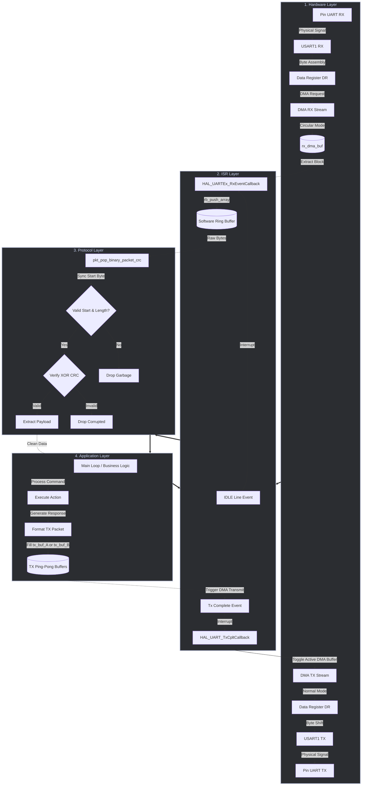

# 🚀 High-Performance UART DMA Driver & HIL Testbench

[](https://platformio.org/)
[](https://www.st.com/en/microcontrollers-microprocessors/stm32f411.html)
[](https://www.st.com/en/embedded-software/stm32cube-mcu-mpu-packages.html)
[](#)

> **Objective:** A production-ready, high-level UART driver implementation designed for the STM32F411CEU6 microcontroller. This project demonstrates an advanced embedded software architecture, leveraging Direct Memory Access (DMA) for **both data transmission (TX) and reception (RX)** to guarantee robust data handling with near-zero CPU overhead. It features double-buffering (Ping-Pong) for TX, a circular buffer with IDLE line detection for RX, and is verified via an automated Hardware-in-the-Loop (HIL) stress test.

---

## 1. Production Architecture Overview

The firmware is designed with a strict separation of concerns, divided into four distinct layers. This modular approach ensures that the application logic is completely decoupled from hardware constraints, eliminating bottlenecks associated with standard blocking calls or byte-by-byte interrupt designs.



### 1. Hardware Layer
At the lowest level, the driver utilizes DMA for both directions:
- **RX Path:** The physical `UART RX` pin receives electrical signals which are assembled by the USART1 Peripheral. The **DMA Controller** automatically pulls raw bytes from the Data Register and streams them into a temporary memory array (`rx_dma_buf`) in Circular Mode.
- **TX Path:** For transmission, the DMA Controller pushes data directly from the active transmit buffer to the USART1 Data Register in Normal Mode. The CPU is completely unburdened during active data transfers in both directions.

### 2. Interrupt Service Routine (ISR) Layer
- **RX IDLE Handling:** When the host finishes transmitting a burst of bytes, an **IDLE Line Interrupt** fires. The `HAL_UARTEx_RxEventCallback` quickly copies the incoming block from the DMA buffer into the thread-safe **Ring Buffer**.
- **TX Double Buffering (Ping-Pong):** When a DMA TX transfer finishes, a **TX Complete Interrupt** fires. The driver uses two buffers (`tx_buf_A` and `tx_buf_B`). While the DMA sends buffer A, the application can safely prepare the next packet in buffer B. The ISR effortlessly swaps the active pointer, keeping the pipeline saturated.

### 3. Protocol Layer
Running asynchronously within the main loop, the protocol layer (`packet_protocol.c`) consumes raw bytes from the RX Ring Buffer. It parses the encapsulated binary frame `[Start][Length][Payload][CRC]`. It computes the XOR checksum over the payload, safely extracting clean data or dropping corrupted packets. 

### 4. Application Layer
The highest level of abstraction. It receives error-free payloads from the protocol layer and generates responses. To transmit data, it formats a response packet, places it in the inactive TX ping-pong buffer, and signals the DMA to kick off transmission. It remains completely abstracted from hardware timings or byte-level parsing.

> [!TIP]
> **Optimization Benefit:** By combining DMA Ping-Pong for TX with DMA+IDLE Line detection for RX, the CPU only intervenes *per data block* rather than *per byte*. This makes it a high-level driver that can process complex payloads asynchronously without blocking mission-critical tasks or dropping frames under heavy traffic.

### Ring Buffer Sizing
The size of the ring buffers can be easily customized by modifying `RING_BUFFER_SIZE` inside `lib/Ring_buffer/uart_ring_buffer.h`.

> [!CAUTION]
> **Sizing Rule:** To prevent buffer overrun and silent data loss, `RING_BUFFER_SIZE` should be configured to be **at least 2x larger** than the maximum possible size of any single received data payload.

---

## 2. Cascading RTS/CTS Flow Control

> [!TIP]
> **Dynamic Configuration:** The hardware flow control (RTS/CTS) mechanism can be explicitly enabled or disabled at compile-time via a configuration macro. This provides flexibility to toggle flow control on or off depending on the remote device's capabilities.

To guarantee zero data loss even under extreme load or when the application is busy, this driver implements a fully integrated hardware/software flow control cascade (when enabled):

1. **Hardware RX Flow Control (Option 1):** The main loop monitors the RX buffer free space. If it drops below the watermark, it temporarily clears the UART Receiver Enable (`RE`) bit. This forces the STM32's hardware to de-assert the **RTS** pin, safely instructing the remote device to halt transmission before our software buffer overflows.
2. **Software TX Flow Control (Option 2):** Before processing incoming packets, the application checks the TX buffer free space against the watermark. If there isn't enough space for a response, it pauses processing, causing the RX buffer to fill up and naturally trigger the Hardware RX Flow Control.
3. **Hardware TX Flow Control (Option 3):** If the remote device de-asserts its RTS (our **CTS** pin), the STM32 hardware automatically pauses UART TX DMA transfers. This causes our TX buffer to fill up, which triggers the Software TX Flow Control, which ultimately halts reception via RTS.

This creates a perfect backpressure mechanism stretching from the remote device's RX buffer all the way back to the remote device's TX buffer, ensuring completely lossless communication.

---

## 3. Hardware Configuration Guide

To replicate this architecture, ensure proper hardware linkage for the DMA controller and UART interrupts.

| Peripheral / Feature | Parameter | Required Configuration |
| :--- | :--- | :--- |
| **USARTX** | Mode | Asynchronous |
| **USARTX / NVIC** | USARTX global interrupt | **Enabled** |
| **USARTX / DMA (RX)** | DMA Request | `USARTX_RX` (Mode: **Circular**) |
| **USARTX / DMA (TX)** | DMA Request | `USARTX_TX` (Mode: **Normal**) |
| **DMA Settings** | Increment Address | Peripheral: **Disabled**, Memory: **Enabled** (MINC) |
| **DMA Settings** | Data Width | Peripheral: `Byte`, Memory: `Byte` |

> [!IMPORTANT]
> **Initialization Order Matters:** Ensure that the DMA controller (and its clock) is initialized **before** the UART initialization. The UART hardware links to the DMA channels during its initialization phase.

---

## 4. Hardware-in-the-Loop (HIL) Python Stress-Test Bench

Validating firmware resilience requires rigorous testing. This repository includes an automated Python-based testbench (`uart_testbench.py`) to validate data integrity under continuous load.

### Binary Protocol Container
The testbench utilizes a structured binary protocol to encapsulate data:
`[Start Marker: 0xAA] [Length: 1B] [Payload: N bytes] [XOR Checksum: 1B]`

### Testbench Operational Logic
- **Bombardment & Backpressure:** Rapidly streams dynamically generated packets to test Ring Buffer elasticity and TX Ping-Pong efficiency.
- **Data Integrity Validation:** Every echoed packet is captured and its `XOR Checksum` is re-calculated, instantly flagging corrupted frames.
- **Metrics Calculation:** Reports *Success Rate*, *Timeouts*, *Throughput (pkt/s)*, and *Effective Bitrate*.

---

## 5. PlatformIO Project Layout

The repository follows a clean, standardized PlatformIO directory structure.

```text
📦 stm32-high-perf-uart-dma-protocol
┣ 📂 include
┃ ┣ 📜 dma.h
┃ ┣ 📜 gpio.h
┃ ┣ 📜 main.h
┃ ┣ 📜 stm32f4xx_it.h
┃ ┗ 📜 usart.h
┣ 📂 lib
┃ ┣ 📂 Packey_protocol       # Binary frame logic & wrappers
┃ ┃ ┣ 📜 packet_protocol.c
┃ ┃ ┗ 📜 packet_protocol.h
┃ ┗ 📂 Ring_buffer           # Thread-safe FIFO API
┃   ┣ 📜 uart_ring_buffer.c
┃   ┗ 📜 uart_ring_buffer.h
┣ 📂 src
┃ ┣ 📜 dma.c                 # DMA initialization
┃ ┣ 📜 gpio.c
┃ ┣ 📜 main.c                # App layer & callback handling
┃ ┣ 📜 stm32f4xx_it.c        # Interrupt vectors
┃ ┗ 📜 usart.c               # UART initialization
┣ 📂 Test_script
┃ ┗ 📜 uart_testbench.py     # Python HIL stress-test bench
┗ 📜 platformio.ini          # Build flags & monitor config
```

> [!NOTE]
> All firmware components are written in modular C, ensuring strict separation of concerns between the Hardware Driver layer, the Protocol Parsing layer, and the Application logic.
